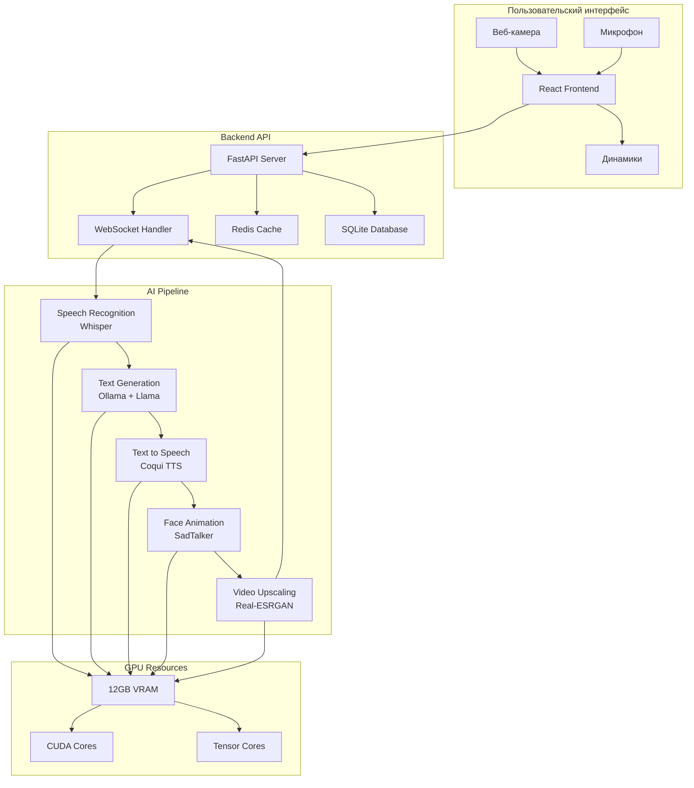

# АРХИТЕКТУРНАЯ ДИАГРАММА СИСТЕМЫ

## Общая архитектура



## Поток данных

### 1. Входящий запрос (от пользователя)
```
Пользователь говорит → Микрофон → Frontend → WebSocket → 
Speech Recognition → Text Generation → Text to Speech → 
Face Animation → Video Upscaling → WebSocket → Frontend → 
Видео + Аудио
```

### 2. Инициализация системы
```
Загрузка фото → Предобработка → Кеширование → 
Загрузка аудиосэмплов → Обучение голоса → 
Настройка персонажа → Готовность к общению
```

## Компоненты системы

### Frontend (React)
- **Назначение**: Пользовательский интерфейс
- **Технологии**: React, TypeScript, Socket.io
- **Функции**:
  - Захват аудио/видео с устройств
  - Отображение анимированного аватара
  - Управление сессией общения
  - Загрузка фото и аудиосэмплов

### Backend API (FastAPI)
- **Назначение**: Сервер приложений
- **Технологии**: Python, FastAPI, Redis
- **Функции**:
  - REST API для управления
  - WebSocket для реального времени
  - Управление файлами
  - Кеширование результатов

### AI Pipeline (Локальные модели)
- **Назначение**: Обработка ИИ
- **Технологии**: PyTorch, CUDA
- **Функции**:
  - Распознавание речи
  - Генерация ответов
  - Синтез речи
  - Анимация лица

## Распределение GPU ресурсов

| Компонент | VRAM | Время выполнения |
|-----------|------|------------------|
| Whisper Base | 1GB | 0.5-1 сек |
| Llama 3.2 8B | 5GB | 1-3 сек |
| Coqui TTS | 2GB | 1-2 сек |
| SadTalker | 3GB | 2-3 сек |
| Real-ESRGAN | 1GB | 0.5 сек |
| **Общий буфер** | 12GB | **5-10 сек** |

## Оптимизация производительности

### 1. Кеширование
- Кеш анимаций для часто используемых фраз
- Кеш аудио для быстрого доступа
- Кеш векторных представлений

### 2. Пайплайнинг
- Параллельная обработка аудио и видео
- Предварительная загрузка моделей
- Асинхронная обработка запросов

### 3. Управление памятью
- Динамическая загрузка/выгрузка моделей
- Очистка кеша при нехватке памяти
- Мониторинг использования GPU 